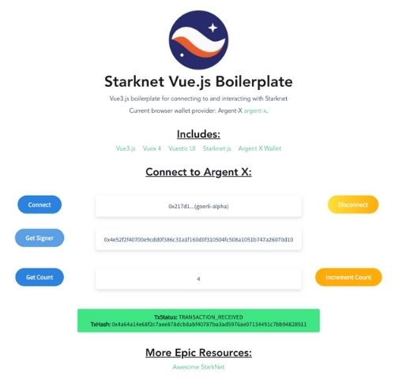

<div align="center">
  
  
  
</div>

<h2 align="center">vue-stark-boil</h2>

<p align="center">
    <a href="https://github.com/dontpanicdao/caigo/blob/main/LICENSE">
        
    </a>
    <a href="https://starkware.co/">
        
    </a>
</p>

Boilerplate project for connecting your Vue.js application to StarkNet

## Boiler Features:
- connect to wallet
- disconnect from wallet
- listen for account change
- update on account change
- call contract
- call contract with discovered address
- invoke contract function
- parse tx response



## Includes Templating For:
- Vue3.js
- Vuex 4
- Vuestic UI
- Starknet.js
- Argent X Wallet

## StarkNet Goerli Alpha Contract:
`0x00f4c5e82ddb6894411d6ae48b33284ed1cc6b167551e0a76f27811700b1c3c2`
Simple counter in storage variable. Anyone can increment and decrement(not passed zero).

steps to deploy(note you do not need to do this, you can test with hardcoded contract address):
```
$ starknet-compile counter.cairo --output counter_compiled.json --abi counter_abi.json
$ starknet deploy --contract counter_compiled.json
Deploy transaction was sent.
Contract address: 0x00f4c5e82ddb6894411d6ae48b33284ed1cc6b167551e0a76f27811700b1c3c2
Transaction hash: 0x2ae72328e197009b62ecc53580659712f78f8a6bdb4384684e22583e69edff6
```

## Project setup
```
npm install
```

### Compiles and hot-reloads for development
```
yarn serve
```

### Compiles and minifies for production
```
yarn build
```

### Lints and fixes files
```
yarn lint
```

### License
See DontPanicDAO license: [DPD License](https://github.com/dontpanicdao/LICENSE/blob/main/LICENSE).
